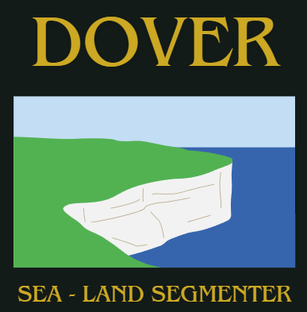

# Dover
### AOL Computer Vision LA08 - Project

    
  

  we will attempt to find the Sea-Land segmentation by means of traditional Computer Vision, specifically clustering-based Image Segmentation using Edge features, Color features, and Texture features. In using traditional Computer Vision methods, certain limitations are present, such as the need to manually extract features in a step called Feature Extraction.
  

#### streamlit deployment
https://alvrian-compvis.streamlit.app/

#### Checkout the details in here
[Link to Canva](https://www.canva.com/design/DAGW5wF8mH0/YOoox5zqUsYZgjjTqZWfDQ/edit?utm_content=DAGW5wF8mH0&utm_campaign=designshare&utm_medium=link2&utm_source=sharebutton_)  

### Binus University
- Alvrian Timotius
- Tiffany Joycelyn
- Kevin Alexander
- Vincentia Catherine
